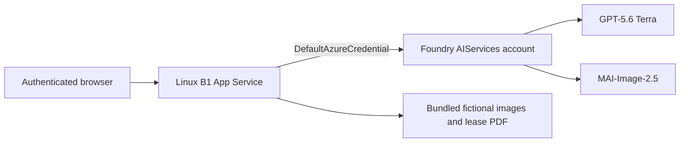

# Reproduce the Aurelia Agency AI demo on Azure

This guide deploys a new, independent copy of the portal. It does not target or modify the original demonstration resources.

## What is provisioned



`infra/main.bicep` creates:

| Resource | Configuration |
| --- | --- |
| Resource group | New group supplied to the script |
| Foundry account | `AIServices`, S0, local key authentication disabled |
| GPT deployment | `gpt-5.6-terra`, version `2026-07-09`, GlobalStandard capacity 10 |
| Image deployment | `MAI-Image-2.5`, version `2026-06-02`, GlobalStandard capacity 1 |
| App Service plan | Linux B1 with Always On |
| Web app | Node.js 20 LTS, HTTPS only, TLS 1.2+, FTPS disabled |
| Managed identity | System-assigned identity on the web app |
| Role assignment | `Cognitive Services User` on only the new Foundry account |

The web app uses Microsoft Entra tokens for model inference. No model API key is provisioned or stored. The portal's shared login stores a salted scrypt hash and random cookie-signing secret as protected App Service settings; the plaintext password is never written to the repository or deployment parameter file.

## Prerequisites

- Azure CLI 2.20 or newer with Bicep support
- PowerShell 7
- Node.js 20 and npm
- Git
- an authenticated Azure CLI session (`az login`)
- permission to create resource groups, Cognitive Services resources, model deployments, App Service resources, and role assignments
- available model quota in the selected region
- a portal password containing 12-256 characters

The exact model versions are intentionally pinned. Availability and quota vary by subscription and region. The provisioning script queries the live model catalog and quota before creating resources. A full deployment stops without changes when either requested model cannot be allocated.

## One-command deployment

From a clean clone:

```powershell
pwsh ./scripts/provision-azure.ps1 `
  -SubscriptionId "<subscription-id>" `
  -ResourceGroupName "rg-aurelia-agency-ai-my-demo" `
  -PortalUsername "agency-user"
```

The script securely prompts for the portal password. It then:

1. selects the requested subscription;
2. checks that the target resource group is safely demo-marked and that the Git worktree is clean;
3. restores packages, runs tests and lint, and verifies artifact hashes;
4. registers `Microsoft.CognitiveServices` and `Microsoft.Web` when necessary;
5. validates model versions, SKUs, and quota;
6. derives the salted credential hash and random session secret in memory;
7. deploys the subscription-scoped Bicep template;
8. creates a ZIP from committed `HEAD` without `.env`;
9. deploys the ZIP through App Service/Kudu build automation;
10. signs in and verifies `/api/status`.

Resource names are deterministic and globally unique for the subscription/resource-group pair. The resource-group name must contain `demo`, `repro`, `test`, or `dev`. Re-running against an intentionally existing group requires `-AllowExistingResourceGroup`, and the group must already carry the template's application, environment, and ownership tags.

### Preview without changing Azure

```powershell
pwsh ./scripts/provision-azure.ps1 `
  -SubscriptionId "<subscription-id>" `
  -ResourceGroupName "rg-aurelia-agency-ai-my-demo" `
  -PortalUsername "agency-user" `
  -WhatIf
```

The model/quota checks and Azure Resource Manager what-if still require Azure access, but no resources or provider registrations are changed. Register `Microsoft.CognitiveServices` and `Microsoft.Web` before using what-if in a fresh subscription.

### Deploy without MAI

If the subscription has GPT capacity but no MAI capacity:

```powershell
pwsh ./scripts/provision-azure.ps1 `
  -SubscriptionId "<subscription-id>" `
  -ResourceGroupName "rg-aurelia-agency-ai-text-demo" `
  -PortalUsername "agency-user" `
  -SkipMai
```

All eight text/analysis scenarios remain available. Marketing image editing remains disabled until a compatible MAI endpoint and deployment are configured.

## Build the deployment package only

The package is created from committed `HEAD`, following App Service's requirement that application files appear at the ZIP root:

```powershell
pwsh ./scripts/build-deployment-package.ps1
```

Output:

```text
artifacts/deploy/agency-ai-demo.zip
```

The script refuses a dirty worktree by default and verifies required application and PDF entries. The ZIP is ignored because it is derived from committed source.

## Validate before provisioning

```powershell
npm ci
npm test
npm run lint
npm run verify:assets
az bicep build --file infra/main.bicep
```

## Runtime configuration

The Bicep template sets:

| Setting | Value |
| --- | --- |
| `MODEL_MODE` | `live` |
| `GPT_ENDPOINT` | New account's `/openai/v1/` endpoint |
| `GPT_AUTH_MODE` | `entra` |
| `GPT_DEPLOYMENT` | `gpt-5.6-terra` |
| `MAI_ENDPOINT` | New account's `services.ai.azure.com` endpoint |
| `MAI_AUTH_MODE` | `entra` |
| `MAI_MODEL` | `MAI-Image-2.5` |
| `PORTAL_CREDENTIAL_HASH` | Secure deployment parameter |
| `PORTAL_SESSION_SECRET` | Secure deployment parameter |
| `SCM_DO_BUILD_DURING_DEPLOYMENT` | `true` |

App Service injects `PORT`; the Express server binds to `0.0.0.0` when `WEBSITE_HOSTNAME` is present. The deployment engine restores production dependencies from `package-lock.json`.

## Post-deployment checks

After signing in:

1. confirm `/api/status` reports GPT-5.6 Terra and, when deployed, MAI-Image-2.5 as configured;
2. open the Meridian House lease and confirm the 25-page PDF preview loads;
3. run one mock request in every scenario;
4. run one Live Foundry request in every text scenario;
5. generate marketing copy, review the edit prompt, and run one MAI image edit.

Live provider failures are surfaced to the browser and are never replaced with mock success.

## Artifacts and scenario documentation

- [`artifacts/README.md`](../artifacts/README.md) explains the committed demo assets and integrity manifest.
- [`docs/scenarios/`](scenarios/) contains one detailed guide per scenario, including request payloads, source schemas, model input, validation, grounding, and limitations.
- [`README.md`](../README.md) covers local operation and provider contracts.

## Security and production considerations

This template reproduces the proven demonstration architecture, which uses public HTTPS endpoints plus authentication. Before adapting it for sensitive production data, evaluate:

- private networking and outbound controls;
- per-user Microsoft Entra authentication instead of a shared portal credential;
- Key Vault references and secret rotation;
- centralized audit, diagnostics, and retention;
- application monitoring and availability design;
- data residency, privacy, and professional-review requirements;
- a controlled CI/CD process rather than operator ZIP deployment.

The current datasets, contacts, properties, leases, telemetry, and sustainability records are fictional.

## Cleanup

The default deployment is isolated in one resource group. After confirming the exact name, delete that specific group:

```powershell
az group delete --name "rg-aurelia-agency-ai-my-demo" --yes --no-wait
```

This permanently removes the copied App Service, identity, Foundry account, model deployments, and role assignment. Never substitute the original production resource-group name.

## Official references

- [Deploy Bicep files with Azure CLI](https://learn.microsoft.com/azure/azure-resource-manager/bicep/deploy-cli)
- [Configure a Node.js App Service](https://learn.microsoft.com/azure/app-service/configure-language-nodejs?pivots=platform-linux)
- [Deploy ZIP packages to App Service](https://learn.microsoft.com/azure/app-service/deploy-zip)
- [Managed identities for App Service](https://learn.microsoft.com/azure/app-service/overview-managed-identity)
- [Cognitive Services model deployment Bicep reference](https://learn.microsoft.com/azure/templates/microsoft.cognitiveservices/accounts/deployments)
- [Microsoft Foundry role-based access control](https://learn.microsoft.com/azure/ai-foundry/concepts/rbac-ai-foundry)
