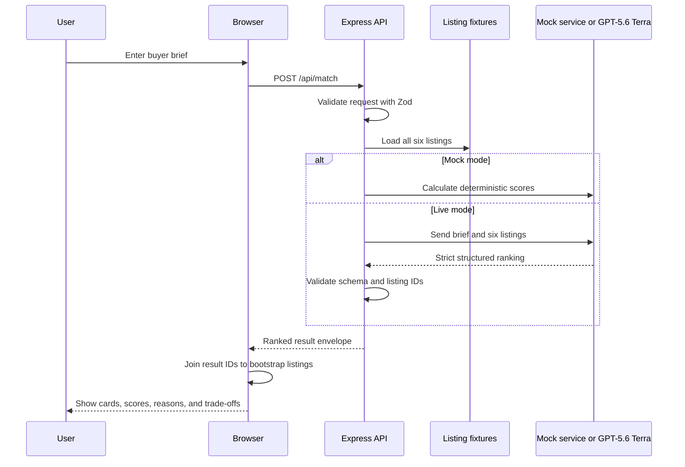

# Scenario 1: Intelligent Property Matching

## Purpose

This scenario turns a buyer brief into an explainable shortlist of fictional Sydney properties. It demonstrates ranking and narrative reasoning, not a production recommendation engine or a connection to a listing platform.

## Components

| Layer | Implementation |
| --- | --- |
| Browser form and rendering | `public/app.js` |
| API route | `POST /api/match` in `server.js` |
| Request and output validation | `matchRequestSchema`, `matchOutputSchema`, and `matchJsonSchema` in `src/schemas.js` |
| Fictional listings | `listings` in `src/data.js` |
| Deterministic implementation | `matchProperties()` in `src/mock-services.js` |
| Live model implementation | `rankProperties()` in `src/providers/gpt.js` |

## End-to-end flow



1. The authenticated browser receives all six fictional listings from `GET /api/bootstrap`.
2. The user enters a brief. `public/app.js` serializes the form and sends it to `POST /api/match`.
3. Express limits JSON bodies to 1 MB and parses the payload with `matchRequestSchema`.
4. The server uses the repository-owned `listings` array as the complete candidate set. The browser cannot replace listing facts in this request.
5. Mock mode calls `matchProperties(brief)`. Live mode calls `rankProperties(brief, listings)`.
6. Live output must match a strict JSON Schema and is then parsed again by Zod.
7. The provider rejects an unknown listing ID or a repeated ID.
8. The browser resolves each returned ID against the bootstrap catalogue and displays authoritative image, price, accommodation, and property type beside the model-produced ranking explanation.

## HTTP request

```http
POST /api/match
Content-Type: application/json
Cookie: aurelia_session=<signed session cookie>
```

```json
{
  "mode": "live",
  "brief": {
    "location": "Double Bay",
    "budget": 4800000,
    "beds": 4,
    "propertyType": "House",
    "priorities": "Quiet street, good schools, water views and village walkability"
  }
}
```

### Request schema

```ts
type MatchRequest = {
  mode?: "mock" | "live"; // defaults to "mock" when omitted
  brief: {
    location: string;     // trimmed, 1-80 characters
    budget: number;       // integer, AUD 500,000-20,000,000; numeric strings are coerced
    beds: number;         // integer, 1-10; numeric strings are coerced
    propertyType: string; // trimmed, 1-40 characters
    priorities?: string;  // trimmed, up to 800 characters; defaults to ""
  };
};
```

Invalid input returns HTTP 400 with an `Invalid request:` message. Live mode without a configured provider returns HTTP 503.

## Listing source-data schema

Every candidate sent to the ranking implementation has this repository-defined shape:

```ts
type Listing = {
  id: string;
  name: string;
  location: string;
  area: string;
  price: number;
  beds: number;
  baths: number;
  parking: number;
  type: string;
  image: string;       // same-origin static asset path
  description: string;
  features: string[];
  attributes: string[];
};
```

The current fixture contains six records. All listing content and images are fictional demonstration data.

## Live model input

The GPT provider sends the following user-input object to the Azure OpenAI Responses API:

```json
{
  "brief": {
    "location": "Double Bay",
    "budget": 4800000,
    "beds": 4,
    "propertyType": "House",
    "priorities": "Quiet street, good schools, water views and village walkability"
  },
  "listings": [
    {
      "id": "harbour-house",
      "name": "Harbour House",
      "location": "Double Bay, Sydney",
      "area": "Double Bay",
      "price": 4650000,
      "beds": 4,
      "baths": 3,
      "parking": 2,
      "type": "House",
      "image": "/assets/properties/harbour-house.png",
      "description": "...",
      "features": ["Harbour outlook", "Private garden", "Walkable village", "Home office"],
      "attributes": ["water views", "schools", "quiet street", "outdoor entertaining", "walkability"]
    }
  ]
}
```

The actual request includes all six listings. The developer instruction tells Terra to use only supplied IDs, calibrate scores, cite evidence, and state trade-offs candidly.

## Mock scoring

`scoreListing()` calculates a score using:

| Factor | Behavior |
| --- | --- |
| Budget | Up to 25 points; reduced as price exceeds budget |
| Location | 22 points for an exact area or `Any Sydney`, otherwise 8 |
| Bedrooms | Up to 14 points |
| Type | 10 points for a match or `Any type`, otherwise 3 |
| Priorities | Up to 29 points from keyword-to-attribute matches |

Recognized priority concepts include water views, schools, quiet street, outdoor entertaining, walkability, restaurants, design, natural light, low maintenance, beach, character, and luxury. Results are sorted by score, then ID, and the top four are returned.

## Response schema

```ts
type MatchResponse = {
  mode: "mock" | "live";
  summary: string; // 10-600 characters
  results: Array<{
    id: string;
    score: number;       // integer, 0-100
    tags: string[];      // 1-5
    rationale: string;   // 10-600 characters
    tradeoffs: string[]; // 1-3
  }>;                    // 1-6
};
```

Example:

```json
{
  "mode": "live",
  "summary": "Harbour House is the strongest overall fit for the stated brief.",
  "results": [
    {
      "id": "harbour-house",
      "score": 94,
      "tags": ["Location fit", "Within budget", "4 bedrooms", "Schools"],
      "rationale": "The property aligns with the budget, accommodation and location requirements.",
      "tradeoffs": ["Strong demand may require decisive inspection timing"]
    }
  ]
}
```

## Data and trust boundaries

- User-entered brief values are untrusted and validated server-side.
- Listing facts come from `src/data.js`, not from the request.
- In Live mode, the brief and all fictional listings leave the App Service only for the configured Azure model endpoint.
- The server does not persist the brief or ranking.
- Output scores and narrative are model judgments in Live mode; listing identity and displayed facts remain repository-controlled.
