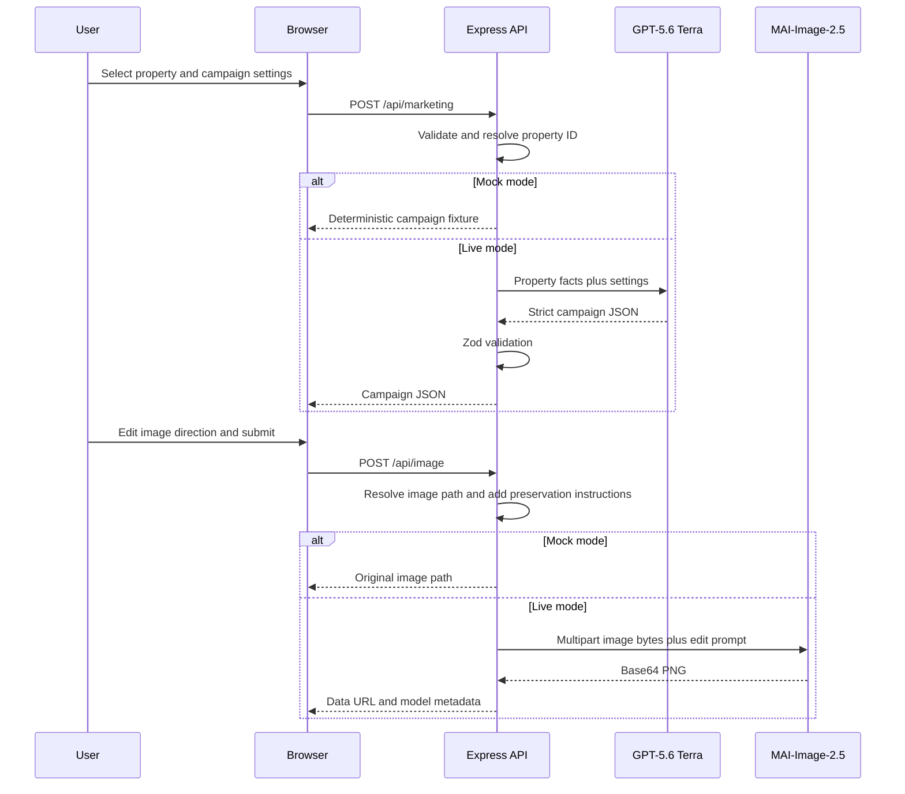

# Scenario 2: Marketing Content and Image Studio

## Purpose

This scenario creates a property campaign from a selected fictional listing and can optionally edit the listing's bundled source photograph. Text generation uses GPT-5.6 Terra; image editing uses MAI-Image-2.5.

## Components

| Layer | Implementation |
| --- | --- |
| Browser forms and campaign renderer | `public/app.js` |
| Text route | `POST /api/marketing` in `server.js` |
| Image route | `POST /api/image` in `server.js` |
| Request and output contracts | `marketingRequestSchema`, `marketingOutputSchema`, `imageRequestSchema`, and `marketingJsonSchema` in `src/schemas.js` |
| Listing fixtures and images | `src/data.js` and `public/assets/properties/` |
| Text providers | `generateMarketing()` in `src/mock-services.js` and `src/providers/gpt.js` |
| Image provider and safeguards | `src/providers/mai-image.js` and `src/property-image-prompts.js` |

## End-to-end flow



The two API calls are independent. Generating copy does not automatically call MAI. The user can review and edit Terra's proposed `imagePrompt` before starting image editing.

## Campaign text request

```http
POST /api/marketing
Content-Type: application/json
```

```json
{
  "mode": "live",
  "propertyId": "harbour-house",
  "settings": {
    "audience": "Upsizing families",
    "channel": "Instagram",
    "tone": "Refined editorial"
  }
}
```

### Request schema

```ts
type MarketingRequest = {
  mode?: "mock" | "live";
  propertyId: string; // at least 1 character; must resolve to a fixture
  settings: {
    audience: string; // trimmed, 1-80 characters
    channel: string;  // trimmed, 1-80 characters
    tone: string;     // trimmed, 1-80 characters
  };
};
```

The server resolves `propertyId` with `findListing()`. Unknown IDs return HTTP 404. The request cannot supply or override price, features, address, description, or image.

## Text model input

```ts
type MarketingModelInput = {
  property: Listing; // full authoritative fixture described in Scenario 1
  settings: {
    audience: string;
    channel: string;
    tone: string;
  };
};
```

Terra receives this object as serialized JSON. Its instructions require Australian English, traceable property claims, restrained campaign language, a channel-appropriate social post, and a visible but credible photo-edit direction. It is explicitly told not to infer protected audience characteristics or invent permanent property features.

## Campaign response schema

```ts
type MarketingResponse = {
  mode: "mock" | "live";
  propertyId: string;
  campaignConcept: string; // 3-80 characters
  headline: string;        // 5-100
  strapline: string;       // 10-180
  description: string;     // 120-1,800
  socialCopy: string;      // 40-900
  highlights: string[];    // 3-6
  callToAction: string;    // 5-140
  imagePrompt: string;     // 20-1,200
};
```

The Responses API uses `marketingJsonSchema` with `additionalProperties: false`. The result is then checked against `marketingOutputSchema`, which enforces the string limits above.

## Mock campaign behavior

Mock mode uses a property-specific campaign direction from `src/mock-services.js`. It combines:

- a fixed concept, headline, strapline, and opening for each listing;
- authoritative features, description, location, price, bedrooms, and bathrooms;
- the selected audience, channel, and tone;
- no model or external network call.

## Image-edit request

```http
POST /api/image
Content-Type: application/json
```

```json
{
  "mode": "live",
  "propertyId": "harbour-house",
  "prompt": "Shift the supplied photograph to warm late-afternoon light and add restrained garden lighting while preserving the house and camera position."
}
```

### Image request schema

```ts
type ImageRequest = {
  mode?: "mock" | "live";
  propertyId: string;
  prompt: string;  // trimmed, 20-2,000 characters
  width?: number;  // coerced integer, 768-1,536; defaults to 1,024
  height?: number; // coerced integer, 768-1,536; defaults to 1,024
};
```

`width` and `height` are accepted by the shared schema, but the current image-to-image route does not pass them to MAI. MAI determines the edited image dimensions from its edit operation and source image.

## Image data path

1. The server resolves the property fixture.
2. It converts the fixture's same-origin image URL into a path under `public/`.
3. It reads the PNG or JPEG bytes on the server. The browser never uploads the source image.
4. `createCampaignEditPrompt()` prefixes the user's direction with architecture-preservation and non-invention controls.
5. `src/providers/mai-image.js` creates multipart form data:

```text
model=<configured MAI deployment>
prompt=<preservation controls plus user direction>
image=@<bundled listing image>
```

6. The server authenticates to MAI with either a server-side key or `DefaultAzureCredential` using the `https://cognitiveservices.azure.com/.default` scope.
7. The provider extracts `data[0].b64_json` and returns a browser-safe data URL.

## Image response schema

The route returns:

```ts
type ImageResponse = {
  mode: "mock" | "live";
  propertyId: string;
  imageUrl: string; // fixture path in mock mode; base64 data URL in live mode
  prompt: string;
  generated: boolean;
  edited?: boolean;
  model: string;
};
```

Mock mode returns the original listing image with `generated: false`; it does not simulate newly generated pixels.

## Reliability and trust boundaries

- Text and image credentials remain server-side.
- The bundled image is read only after a known property ID is resolved, preventing arbitrary path input.
- MAI requests retry once for transient network failures, HTTP 429, or server errors.
- The original image remains unchanged if editing fails.
- Campaign claims and edited imagery require human review. The prompt controls reduce invention but do not prove visual accuracy.
- No generated text or image is persisted by the application.
