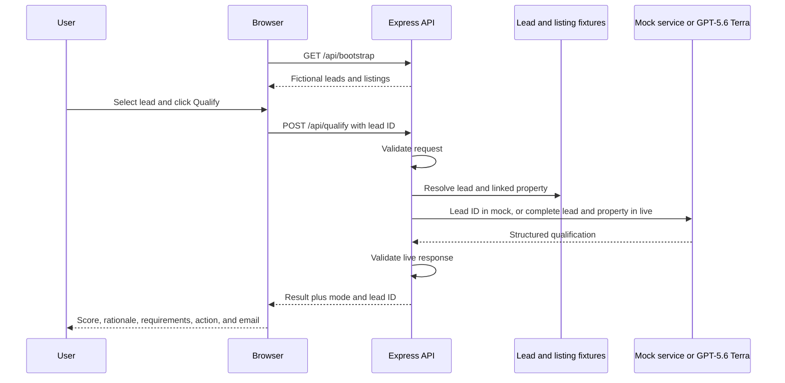

# Scenario 3: Lead Qualification

## Purpose

This scenario classifies a fictional inbound property enquiry, extracts buyer requirements, recommends a follow-up, and drafts an email. It demonstrates assisted sales triage rather than automated eligibility, credit, or protected-characteristic decision-making.

## Components

| Layer | Implementation |
| --- | --- |
| Lead list and result renderer | `public/app.js` |
| API route | `POST /api/qualify` in `server.js` |
| Contracts | `qualificationRequestSchema`, `qualificationOutputSchema`, and `qualificationJsonSchema` in `src/schemas.js` |
| Fictional leads and listings | `src/data.js` |
| Mock result fixtures | `qualifyLead()` in `src/mock-services.js` |
| Live model call | `qualifyLead()` in `src/providers/gpt.js` |

## End-to-end flow



The browser displays lead identity and enquiry details from bootstrap data, but submits only the selected `leadId`. The server re-resolves the lead and linked property, so a client cannot alter the lead message or property facts in the qualification request.

## HTTP request

```http
POST /api/qualify
Content-Type: application/json
```

```json
{
  "mode": "live",
  "leadId": "lead-amanda"
}
```

### Request schema

```ts
type QualificationRequest = {
  mode?: "mock" | "live";
  leadId: string; // at least 1 character and must match a fixture
};
```

An unknown lead returns HTTP 404. If its linked property were missing, property resolution would also return HTTP 404 before any model call.

## Lead source-data schema

```ts
type Lead = {
  id: string;
  name: string;
  initials: string;
  source: string;
  received: string;
  propertyId: string;
  message: string;
  contact: string;
};
```

Example fictional record:

```json
{
  "id": "lead-amanda",
  "name": "Amanda Chen",
  "initials": "AC",
  "source": "Website enquiry",
  "received": "12 min ago",
  "propertyId": "harbour-house",
  "message": "We have sold in Melbourne and are relocating in six weeks. Harbour House looks ideal. We need four bedrooms, a quiet street and good schools. Can inspect this Saturday and have finance approved to $4.8m.",
  "contact": "amanda.chen@example.com"
}
```

The current dataset has four fictional leads. Because `/api/bootstrap` supports the lead-list UI, these records and their fictional contact addresses are available to the authenticated browser.

## Live model input

```ts
type QualificationModelInput = {
  lead: Lead;
  property: Listing;
};
```

The exact user content sent to Terra is equivalent to:

```json
{
  "lead": {
    "id": "lead-amanda",
    "name": "Amanda Chen",
    "initials": "AC",
    "source": "Website enquiry",
    "received": "12 min ago",
    "propertyId": "harbour-house",
    "message": "...",
    "contact": "amanda.chen@example.com"
  },
  "property": {
    "id": "harbour-house",
    "name": "Harbour House",
    "price": 4650000,
    "beds": 4,
    "baths": 3,
    "parking": 2,
    "type": "House",
    "description": "...",
    "features": ["Harbour outlook", "Private garden", "Walkable village", "Home office"],
    "attributes": ["water views", "schools", "quiet street", "outdoor entertaining", "walkability"]
  }
}
```

The complete listing includes its location and image path as defined in `src/data.js`. The model instruction asks Terra to extract requirements, avoid overstating intent, propose a practical action, and draft a concise personal response.

## Response schema

```ts
type QualificationResponse = {
  mode: "mock" | "live";
  leadId: string;
  score: number; // integer, 0-100
  grade: "Priority" | "Qualified" | "Nurture" | "Low intent";
  urgency: "Immediate" | "Near term" | "Exploratory";
  intent: "High" | "Medium" | "Low";
  requirements: string[]; // 2-8
  rationale: string;      // 20-800 characters
  nextAction: string;     // 10-400
  followUpSubject: string;// 5-140
  followUpDraft: string;  // 30-1,600
};
```

`qualificationJsonSchema` prevents additional model fields and constrains score and enums. Zod applies the full string and array limits before the API responds.

## Mock behavior

Mock mode returns a deep copy of a predefined result for the selected lead. The fixtures cover:

- a high-intent relocation buyer;
- an early-stage warehouse-apartment buyer;
- near-term downsizers;
- a low-information coastal investment enquiry.

No heuristic is calculated in Mock mode; the result is intentionally stable for demonstrations and tests.

## Data classification and limitations

| Data category | Current treatment |
| --- | --- |
| Identity and contact | Fictional fixture data |
| Enquiry content | Fictional fixture data |
| Property facts | Fictional repository data |
| Score and intent | Mock fixture or model judgment |
| Follow-up email | Generated draft; not sent |

- The application does not connect to a CRM, email service, or marketing automation platform.
- No email is sent and no lead status is persisted.
- Live mode sends the fictional lead, including its contact field, to the configured Azure model endpoint.
- A production implementation should minimize browser bootstrap fields, apply CRM authorization, define retention controls, and prevent use of protected attributes in scoring.
