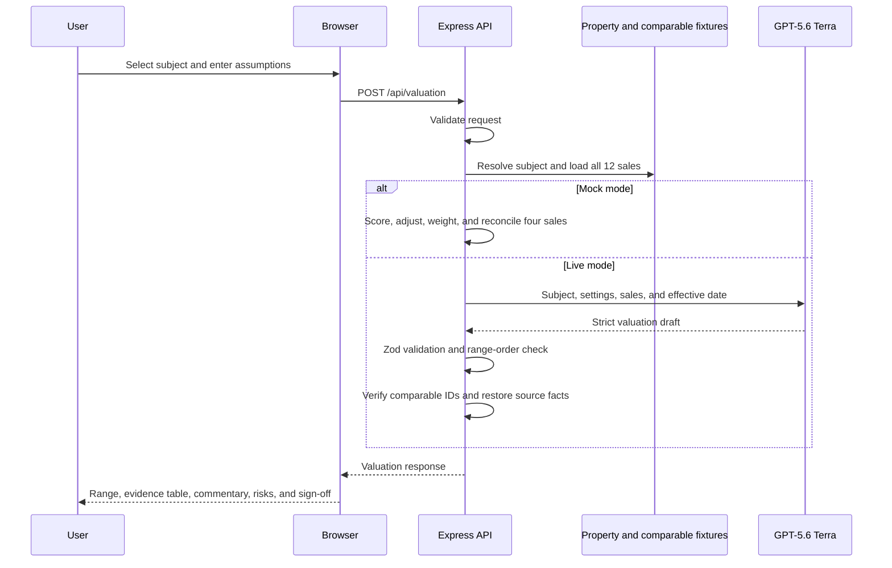

# Scenario 4: Valuation Assistant

## Purpose

This scenario produces an indicative property valuation draft from a selected fictional subject property, user-entered assumptions, and 12 fictional comparable transactions. It is designed for qualified-valuer review and is not an automated or certified valuation.

## Components

| Layer | Implementation |
| --- | --- |
| Valuation form and report | `public/app.js` |
| API route | `POST /api/valuation` in `server.js` |
| Contracts | `valuationRequestSchema`, `valuationOutputSchema`, and `valuationJsonSchema` in `src/schemas.js` |
| Subject and comparable data | `listings` and `comparableSales` in `src/data.js` |
| Deterministic valuation | `draftValuation()` in `src/mock-services.js` |
| Live generation and grounding | `draftValuation()` and `groundValuationComparables()` in `src/providers/gpt.js` |

## End-to-end flow



## HTTP request

```http
POST /api/valuation
Content-Type: application/json
```

```json
{
  "mode": "live",
  "propertyId": "harbour-house",
  "settings": {
    "purpose": "Pre-listing appraisal",
    "condition": "Renovated",
    "valuerNotes": "Assume vacant possession and no material building defects."
  }
}
```

### Request schema

```ts
type ValuationRequest = {
  mode?: "mock" | "live";
  propertyId: string;
  settings: {
    purpose: string;     // trimmed, 1-80 characters
    condition: string;   // trimmed, 1-40 characters
    valuerNotes?: string;// trimmed, up to 800; defaults to ""
  };
};
```

Only the property ID and valuation assumptions come from the browser. The server resolves the subject and supplies the complete comparable dataset.

## Comparable source-data schema

```ts
type ComparableSale = {
  id: string;
  address: string;
  area: string;
  type: string;
  saleDate: string;
  salePrice: number;
  beds: number;
  baths: number;
  parking: number;
  landArea: number;
  condition: string;
  notes: string;
};
```

There are 12 fictional records across Double Bay, Bellevue Hill, Rose Bay, Bronte, Mosman, Neutral Bay, Surry Hills, Redfern, Woollahra, Paddington, Barangaroo, and The Rocks.

## Live model input

```ts
type ValuationModelInput = {
  property: Listing;
  settings: {
    purpose: string;
    condition: string;
    valuerNotes: string;
  };
  comparables: ComparableSale[]; // all 12 records
  effectiveDate: "16 July 2026";
};
```

Terra is told to use only supplied comparable IDs and facts, explain adjustments, keep the range ordered, and avoid representing the result as certified.

## Mock calculation

Mock mode performs a transparent deterministic calculation:

1. Score each comparable:
   - same property type: 4 points;
   - same area: 3 points;
   - bedrooms within one: 2 points;
   - bathrooms within one: 1 point.
2. Select the four highest-scoring sales, breaking ties by higher sale price.
3. Calculate adjustments:

```text
accommodation =
  bedroom difference * AUD 110,000 for apartment/penthouse subjects
  bedroom difference * AUD 150,000 for other subjects

bathroom = bathroom difference * AUD 70,000
parking = parking difference * AUD 90,000
location = 12% of subject guide minus sale price, rounded, when suburb differs
condition = 0 when equal, +AUD 125,000 for Renovated, otherwise -AUD 75,000
```

4. Assign weights of 35%, 30%, 20%, and 15%.
5. Calculate a weighted evidence value.
6. Blend 75% weighted evidence with 25% of the subject's fixture guide price.
7. Round the midpoint to AUD 25,000 and set the low/high range at approximately -4%/+4%.

This is demonstration logic, not an industry AVM.

## Response schema

```ts
type ValuationResponse = {
  mode: "mock" | "live";
  propertyId: string;
  valueLow: number;  // positive integer
  valueMid: number;  // positive integer
  valueHigh: number; // positive integer
  confidence: "High" | "Medium" | "Limited";
  effectiveDate: string; // 5-80 characters
  summary: string;       // 20-1,000
  comparables: Array<{
    id: string;
    address: string;
    saleDate: string;
    salePrice: number;
    adjustedValue: number;
    weight: number;      // integer, 1-100
    adjustments: string[]; // 1-6
    rationale: string;   // 10-500
  }>;                    // 3-5
  marketCommentary: string; // 20-1,000
  assumptions: string[];    // 2-8
  risks: string[];          // 1-6
  signOff: string;          // 10-400
};
```

Zod additionally requires:

```text
valueLow <= valueMid <= valueHigh
```

## Grounding controls

After a valid Live response, `groundValuationComparables()`:

1. builds a map of the 12 source sales by ID;
2. rejects any unknown ID;
3. rejects duplicate IDs;
4. replaces each returned `address`, `saleDate`, and `salePrice` with the fixture values.

Terra can propose adjusted value, weight, adjustment labels, rationale, range, and narrative. It cannot alter the displayed source transaction identity, address, sale date, or sale price.

## Data and review boundaries

- Subject properties and transactions are fictional.
- User notes are sent to Terra in Live mode and are not persisted.
- No title, planning, area, inspection, market-feed, or external sales database is queried.
- The current effective date is a fixed demonstration date.
- All output requires qualified-valuer inspection, source verification, and approval.
