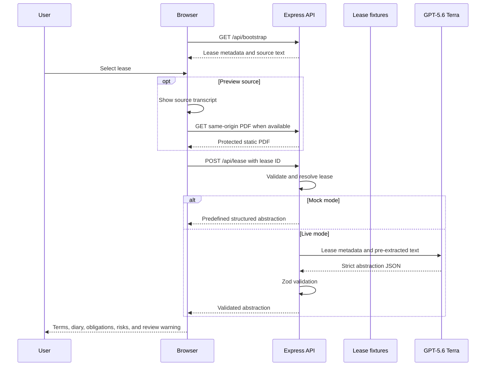

# Scenario 5: Lease and Contract Abstraction

## Purpose

This scenario extracts commercial terms, obligations, dates, and review risks from fictional lease source text. One sample includes a reproducibly generated 25-page PDF for visual inspection. The result is an abstraction draft, not legal advice.

## Components

| Layer | Implementation |
| --- | --- |
| Lease selector, preview, and report | `public/app.js` |
| API route | `POST /api/lease` in `server.js` |
| Contracts | `leaseRequestSchema`, `leaseOutputSchema`, and `leaseJsonSchema` in `src/schemas.js` |
| Lease metadata and extracted text | `leaseDocuments` in `src/data.js` |
| Long Meridian source | `src/lease-source.js` |
| PDF generator and asset | `scripts/generate-lease-pdf.mjs` and `public/assets/documents/` |
| Mock abstractions | `abstractLease()` in `src/mock-services.js` |
| Live extraction | `abstractLease()` in `src/providers/gpt.js` |

## End-to-end flow



## Lease source records

```ts
type LeaseDocument = {
  id: string;
  title: string;
  fileName: string;
  source: string;      // fictional source-system label
  pageCount: number;
  pdfUrl?: string;     // only present when a same-origin PDF exists
  updated: string;
  content: string;     // pre-extracted text supplied to the model
};
```

The current records are:

| ID | Type | Reported pages | PDF binary | Model source |
| --- | --- | ---: | --- | --- |
| `lease-meridian` | Office | 25 | Yes | Full matching extracted text |
| `lease-arcade` | Retail | 62 | No | Concise fictional source transcript |
| `lease-logistics` | Industrial | 55 | No | Concise fictional draft transcript |

The SharePoint and Dataverse labels are illustrative metadata only. The application does not connect to either system.

## PDF and source-text path

For Meridian House:

1. `src/lease-source.js` defines the fictional lease page structure and concatenated extraction text.
2. `scripts/generate-lease-pdf.mjs` creates `meridian-house-office-lease-demo.pdf`.
3. `pageCount` is derived from `meridianLeasePages.length`, keeping metadata aligned with the source.
4. The authenticated browser embeds `pdfUrl` in an iframe and also exposes open/download links.
5. The browser shows the matching raw source text.
6. The server sends the `content` string to Terra. It does **not** upload or parse the PDF during an abstraction request.

For the other samples, the preview dialog shows the complete fixture transcript and explicitly states that no PDF binary is stored.

## HTTP request

```http
POST /api/lease
Content-Type: application/json
```

```json
{
  "mode": "live",
  "leaseId": "lease-meridian"
}
```

### Request schema

```ts
type LeaseRequest = {
  mode?: "mock" | "live";
  leaseId: string; // at least 1 character and must match a fixture
};
```

The browser sends no raw lease content. The server resolves it from `src/data.js`. Unknown IDs return HTTP 404.

## Live model input

The provider serializes the entire resolved lease:

```json
{
  "lease": {
    "id": "lease-meridian",
    "title": "Meridian House · Office lease",
    "fileName": "meridian-house-office-lease-demo.pdf",
    "source": "Demo document library · Executed leases",
    "pageCount": 25,
    "pdfUrl": "/assets/documents/meridian-house-office-lease-demo.pdf",
    "updated": "Executed 12 June 2026",
    "content": "COMMERCIAL OFFICE LEASE ... full pre-extracted text ..."
  }
}
```

Terra is instructed to:

- extract only supported terms;
- preserve uncertainty and source conflicts;
- identify deadlines and obligations;
- avoid inventing missing clauses;
- keep individual clause summaries at or below 600 characters;
- keep `reviewNote` to one to three sentences and at or below 900 characters;
- require professional legal review.

## Response schema

```ts
type LeaseResponse = {
  mode: "mock" | "live";
  leaseId: string;
  documentTitle: string;    // 3-180 characters
  executiveSummary: string; // 20-1,000
  parties: {
    landlord: string;       // 2-200
    tenant: string;         // 2-200
  };
  premises: string;         // 5-300
  term: {
    commencement: string;   // 3-100
    expiry: string;         // 3-100
    initialTerm: string;    // 2-100
    options: string;        // 2-600
  };
  rent: {
    baseAnnual: string;     // 2-600
    payment: string;        // 2-600
    review: string;         // 2-600
  };
  incentive: string;        // 2-600
  security: string;         // 2-600
  outgoings: string;        // 2-600
  permittedUse: string;     // 2-600
  breakClause: string;      // 2-600
  criticalDates: Array<{
    date: string;           // 2-100
    event: string;          // 3-240
    owner: "Landlord" | "Tenant" | "Both";
  }>;                       // 2-8
  tenantObligations: string[];   // 2-10
  landlordObligations: string[]; // 1-8
  risks: Array<{
    severity: "High" | "Medium" | "Low";
    title: string;          // 3-120
    detail: string;         // 10-500
    clause: string;         // 2-120
  }>;                       // 1-8
  reviewNote: string;       // 10-900
};
```

The strict model JSON Schema and runtime Zod schema use the same 600-character clause and 900-character review-note constants. This prevents a valid detailed model response from being rejected by a shorter, inconsistent runtime limit.

## Mock behavior

Mock mode returns one stable abstraction fixture per lease. The fixtures intentionally demonstrate:

- no tenant break and make-good exposure;
- retail relocation, demolition, and turnover-rent risk;
- conflicting security requirements and a costly industrial break option.

No PDF parsing or model call occurs in Mock mode.

## Validation and limitations

- The route validates model structure and lengths but does not independently verify every extracted phrase against its source span.
- There are no page-level citations in the current output contract.
- Lease content is returned to the authenticated browser through bootstrap to support the preview.
- In Live mode, the full selected `content` string and lease metadata are sent to the configured Azure model endpoint.
- No lease, abstraction, date reminder, or review decision is persisted.
- A lawyer must compare the abstraction against the complete executed document, schedules, amendments, and execution pages.
