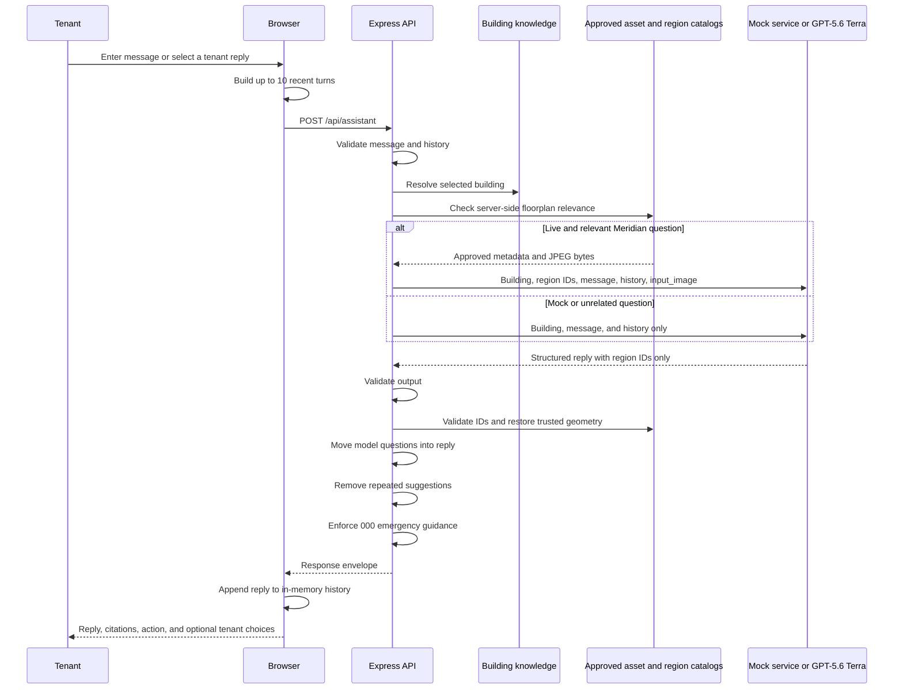

# Scenario 6: Tenant Virtual Assistant

## Purpose

This scenario answers tenant questions from a selected building's fictional knowledge articles, handles multi-turn context, interprets an approved Meridian House Level 12 floorplan when relevant, triages facilities issues, and returns a transparent work-order hand-off. It does not connect to a real help desk, lease system, or facilities platform.

## Components

| Layer | Implementation |
| --- | --- |
| Conversation UI and history | `public/app.js` |
| API route | `POST /api/assistant` in `server.js` |
| Contracts | `assistantRequestSchema`, `assistantOutputSchema`, and `assistantJsonSchema` in `src/schemas.js` |
| Building knowledge | `buildingProfiles` in `src/data.js` |
| Approved floorplan registry and loader | `src/floorplan-assets.js` |
| Verified segmentation index (regions, fixtures, relations) | `src/floorplan-index/meridian-house-level-12.json` |
| Index loader, validation and fact derivation | `src/floorplan-index.js` |
| Validated semantic regions and renderer hints | `src/floorplan-regions.js` |
| Repetition filtering | `src/assistant-conversation.js` |
| Mock triage | `answerTenant()` in `src/mock-services.js` |
| Live response and safety normalization | `respondToTenant()`, `normalizeAssistantFollowUps()`, and `ensureEmergencyGuidance()` in `src/providers/gpt.js` |

## End-to-end flow



## Building source-data schema

```ts
type BuildingProfile = {
  id: string;
  name: string;
  address: string;
  type: string;
  serviceHours: string;
  emergencyContact: string;
  floorplans: FloorplanAsset[];
  knowledge: Array<{
    title: string;
    content: string;
  }>;
};

type FloorplanAsset = {
  id: string;
  buildingId: string;
  floor: string;
  title: string;
  imageUrl: string;
  mimeType: "image/jpeg";
  alt: string;
  description: string;
};

type FloorplanRegion = {
  id: string;
  label: string;
  type: "room" | "circulation" | "transition" | "service" | "outdoor";
  areaSqm?: number;
  polygon: Array<{ x: number; y: number }>; // normalized 0-1000
  labelAnchor: { x: number; y: number };
};
```

The three fictional profiles cover Meridian House, The Arcade, and Southbank Exchange. Their articles cover access, deliveries, HVAC, amenities, maintenance response, waste, tenant responsibilities, and emergency isolation. Only Meridian House has an approved floorplan: the neutral demonstration JPEG at `public/assets/floorplans/meridian-house-level-12-floorplan.jpeg`. Its server-owned `meridian-house-level-12` catalog contains stable semantic IDs and validated polygons for supported rooms and circulation areas. The original 2256×1304 JPEG is never modified.

## HTTP request

```http
POST /api/assistant
Content-Type: application/json
```

```json
{
  "mode": "live",
  "buildingId": "building-meridian",
  "message": "The air conditioning is still hot on level 12.",
  "history": [
    {
      "role": "user",
      "content": "The office is very warm this afternoon."
    },
    {
      "role": "assistant",
      "content": "I can help check whether this is inside the normal HVAC schedule. Which floor is affected?"
    }
  ]
}
```

### Request schema

```ts
type AssistantRequest = {
  mode?: "mock" | "live";
  buildingId: string;
  message: string; // trimmed, 2-1,200 characters
  history?: Array<{
    role: "user" | "assistant";
    content: string; // trimmed, 1-1,600 characters
  }>;                // maximum 10; defaults to []
};
```

## Browser history behavior

The browser keeps conversation state in memory:

1. It takes the last 10 entries before adding the current message.
2. For an assistant turn that offered quick replies, it appends:

```text
Previously offered tenant quick replies: <reply 1> | <reply 2>
```

3. It truncates each serialized history item to 1,600 characters.
4. It sends the current message separately.
5. After a response, it stores the assistant's reply and structured response in browser state.

Refreshing or changing the building resets the relevant browser conversation; there is no server-side conversation database.

## Live model input

```ts
type AssistantModelInput = {
  building: BuildingProfile;
  floorplanCatalog: null | {
    id: string;
    assetId: string;
    regions: Array<{
      id: string;
      label: string;
      type: string;
      areaSqm: number | null;
      description: string;
    }>;
  };
  message: string;
  history: Array<{
    role: "user" | "assistant";
    content: string;
  }>;
};
```

For unrelated questions, Terra receives only the selected building profile, current message, and supplied recent history. The server removes floorplans from the model-facing building object for those calls.

For a relevant Meridian House question, the server resolves the asset from its fixed registry, reads the approved file, and appends this Responses API content item after the JSON text input:

```json
{
  "type": "input_image",
  "image_url": "data:image/jpeg;base64,<server-created image bytes>",
  "detail": "original"
}
```

The browser never supplies an image URL, asset ID, file path, or image bytes. GPT-5.6 Terra receives the image only when the current message mentions a floorplan, layout, navigation, or a feature represented on the plan. A contextual follow-up such as "reverse that route" also keeps the image when a recent turn established floorplan context. Image input uses `detail: "original"` because floorplans contain dense labels and spatial relationships.

The model-facing region catalog contains semantic descriptions but no polygons, boundaries, label anchors, dimensions, or SVG. Terra can select regions but cannot author rendering geometry.

## Segment first, then answer from the index

Spatial facts are not typed into code. `src/floorplan-index/meridian-house-level-12.json` is a committed segmentation of the plan: each room is a polygon, each plumbing fixture is an individual point with a kind (`wc`, `urinal`, `basin`), and rooms nest through `parentId`. `src/floorplan-index.js` loads that artifact, validates it, and *derives* every count by testing which fixture points fall inside which room polygon. Startup fails if a child room escapes its parent or a fixture lands in zero or several rooms, so a bad segmentation can never reach a tenant.

Everything downstream reads those derived values:

- grounded replies quote derived cubicle, urinal and basin counts rather than hard-coded numbers;
- room-to-room wording ("the eastern room of the Toilets block") comes from comparing bounding boxes, not from prose;
- the model-facing catalog carries each region's derived `facts`, a coarse `position`, and the validated `relations` list, and tells Terra to treat them as authoritative instead of re-counting fixtures from the picture;
- annotation geometry stays server-owned, so the answer text and the overlay are computed from the same verified source.

Terra is instructed to:

- answer only from building knowledge and conversation;
- avoid inventing access, account, or lease facts;
- advance the conversation instead of repeating prior content;
- ask Aurelia's questions in `reply`;
- provide only ready-to-send tenant statements in `suggestions`;
- create a work order only for an actionable facilities fault;
- cite supplied articles or contact details;
- use a floorplan only when the approved image was supplied;
- return only approved region IDs, `primary`/`secondary`/`context` roles, relationship intent, optional direction, and short reasons;
- return `annotation: null` when no validated catalog region confidently supports the answer;
- never return coordinates, boxes, polygons, paths, SVG, colors, labels, or dimensions;
- infer the user's semantic intent and endpoint order from natural language, conversation and image, including indirect follow-ups such as "the other way round";
- use only listed circulation links when narrating a route; the server independently computes and draws the canonical intermediate path from the selected endpoint IDs;
- distinguish visible layout interpretation from authoritative building policy;
- never present a static plan as proof of accessibility, current obstructions, occupancy, or emergency routes;
- prioritize emergency safety.

## Response schema

```ts
type AssistantResponse = {
  mode: "mock" | "live";
  buildingId: string;
  reply: string; // 20-1,600 characters
  category:
    | "Building information"
    | "Maintenance"
    | "Access & security"
    | "Lease & payments"
    | "Amenity booking"
    | "Emergency";
  urgency: "Routine" | "Priority" | "Emergency";
  recommendedAction: string; // 5-500
  citations: string[];       // 1-4, each 2-160
  workOrder: {
    created: boolean;
    reference: string;       // up to 80
    summary: string;         // up to 300
    nextUpdate: string;      // up to 200
  };
  floorplan: {
    included: boolean;
    assetId: string;         // up to 80
    title: string;           // up to 160
    floor: string;           // up to 80
    imageUrl: string;        // up to 240
    alt: string;             // up to 300
    caption: string;         // up to 500
    annotation: null | {
      width: 2256;
      height: 1304;
      regions: Array<{
        id: string;
        label: string;
        type: string;
        areaSqm: number | null;
        role: "primary" | "secondary" | "context";
        reason: string;
        polygon: Array<{ x: number; y: number }>; // authoritative source pixels
        labelAnchor: { x: number; y: number };
      }>;
      relationship: {
        type: "location" | "adjacency" | "direction" | "route" | "count" | "size";
        fromRegionId: string | null;
        toRegionId: string | null;
        direction: string | null;
        label: string;
      };
      marker: null | {
        kind: "shared-boundary" | "direction-arrow" | "axis-arrow" | "route-path";
        // exactly 2 points for every kind except route-path, which carries
        // 2-16 server-computed waypoints
        points: Array<{ x: number; y: number }>;
      };
      safetyNote: string;
    };
  };
  suggestions: string[];     // 0-3, each 2-160
};
```

## Post-generation controls

After Zod validation, the provider applies three behavioral controls:

1. **Floorplan grounding:** when no image was supplied, any returned floorplan or annotation ID is rejected. When an image was supplied, unknown or duplicate region IDs, inconsistent endpoints, and undeclared adjacency claims are rejected. A valid Live model intent takes precedence over phrase-based fallbacks. For a route, the model supplies only the semantic origin and destination; the server discards unrelated selections, computes every intermediate region and doorway, and replaces all IDs with authoritative labels, source-pixel polygons, dimensions, and renderer hints. Model output has no geometry fields.
2. **Question normalization:** any suggestion ending in `?` is removed from the button list and appended to Aurelia's `reply` when it fits within the 1,600-character limit.
3. **Emergency guidance:** when `urgency` is `Emergency` and the reply does not contain `000`, the server prepends explicit emergency-services guidance, truncating the original response if necessary.

`filterSuggestedReplies()` also removes duplicate or near-repeated tenant suggestions based on the conversation.

## Mock behavior

Mock mode uses keyword routing:

| Message pattern | Result |
| --- | --- |
| Fire, smoke, gas, serious injury, spill | Emergency guidance; no routine work order |
| Leak, flood, burst | Priority maintenance work order |
| Air conditioning, hot, cold, HVAC | Routine comfort work order |
| Pass, access, visitor, entry | Access guidance |
| Rent, invoice, lease, payment | Route to authorized property management |
| Specific supported floorplan relationship | Question-specific validated regions and marker |
| Broad or unsupported floorplan request | Approved original plan without a highlight |
| Other | General building information |

It cites the closest building article and/or the building contact. Floorplan questions cite the matching Meridian House floorplan article and pass deterministic ID-only intents through the same grounding helper as Live mode. Mock responses cover location, adjacency, direction, count, size, and transition-direction examples. Work-order references are fictional response fields.

## Why validated regions

A 10-case GPT-5.6 Terra evaluation separated answer correctness from visual grounding. Direct uncorrected boxes averaged 97.5 for answers and 89 for grounding, but the three abstract cases averaged only 76.7 grounding and passed 1/3. Model-generated polygons improved those abstract cases to 82 and 2/3, but one polygon self-intersected and a route crossed walls and the stair core. Model-selected validated regions averaged 98 grounding and passed 3/3.

The portal therefore uses full-region fills for entities, a catalog-declared shared boundary for adjacency, a centroid arrow for simple direction, and an axis arrow contained inside a transition region.

## Verified circulation routes

Wayfinding is answered from a separately validated topology graph rather than model inference. The index declares `connects` relations, each naming two regions, the opening type (`door`, `opening`, `sliding partition`, `service door`) and a doorway waypoint in source pixels. `validateFloorplanIndex()` rejects a connection whose waypoint does not sit on both regions' boundaries within tolerance, whose regions are unknown or identical, or that duplicates another pair. Every waypoint was checked against the source JPEG at high zoom before being committed.

`src/floorplan-routing.js` builds a graph from those relations and runs Dijkstra over doorway-to-doorway distance, breaking ties on leg count. The route is therefore fully deterministic and can only traverse drawn openings.

The split of responsibilities is:

| Layer | Owns |
| --- | --- |
| Deterministic index and graph | Which rooms exist, their geometry, which openings connect them, and the exact route drawn on the plan |
| GPT-5.6 Terra | Reading unconstrained natural language and conversation, deciding the visual relationship, resolving route endpoints, and writing the comprehensive answer from the image and geometry-free catalog |
| Server verification | Substituting the deterministic sentence when the model's prose contradicts the index |

Terra receives the region catalog and geometry-free circulation links but never coordinates. It returns only semantic route endpoints. The server then computes the canonical route and builds the `route-path` marker entirely from server waypoints (`fromRegion.labelAnchor`, each doorway in order, `toRegion.labelAnchor`), so omitted or irrelevant model selections cannot distort the route and the drawn polyline cannot cross a wall.

`verifyFloorplanReply()` verifies rather than replaces. When a question has no deterministic answer the model's reply passes through untouched. When it does, the reply is checked for fixture counts absent from the index, catalogued regions that are not on the resolved route, and compass directions that contradict the grounded sentence; any conflict substitutes the deterministic sentence.

Route answers carry a narrower safety note: the path follows the circulation drawn on the plan, but is not checked for step-free access, door locking or emergency egress.

## Data and operational boundaries

- The authenticated browser receives all fictional building profiles and articles from bootstrap.
- User messages and recent history are sent to Terra in Live mode and are not persisted by the server.
- The approved JPEG bytes are sent to Terra only for server-detected relevant Meridian House questions; image inputs are billed as model tokens.
- The public image URL is safe to display, but its local filesystem path is never accepted from or returned to the browser.
- The inline card overlays accessible SVG regions on the unchanged JPEG, provides a keyboard-operable original-plan toggle, visible labels and a text legend, and retains full-size open and download controls.
- Unsupported or ambiguous questions return text-only or the approved original plan without a highlight.
- The plan is a static demonstration, not a live occupancy, accessibility, connectivity, or emergency-navigation system. Routes follow drawn openings only and are not checked for step-free access, door locking or emergency egress.
- `workOrder.created: true` does not create anything outside the response JSON.
- Citations name source articles but do not provide retrieval-time document links.
- The assistant has no access to tenant identity, account balance, lease ledger, pass database, sensor systems, or external emergency services.
- Users must call `000` themselves for immediate danger.
