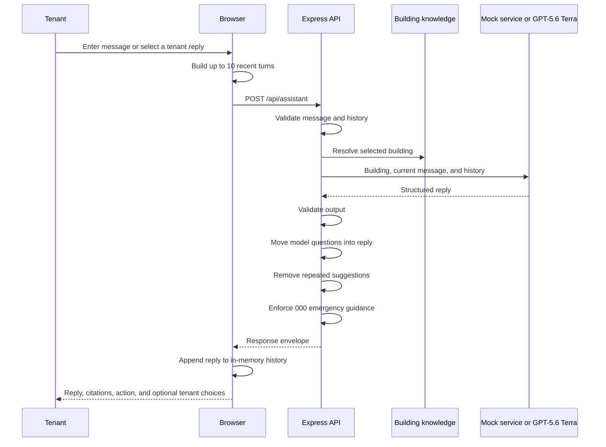

# Scenario 6: Tenant Virtual Assistant

## Purpose

This scenario answers tenant questions from a selected building's fictional knowledge articles, handles multi-turn context, triages facilities issues, and returns a transparent work-order hand-off. It does not connect to a real help desk, lease system, or facilities platform.

## Components

| Layer | Implementation |
| --- | --- |
| Conversation UI and history | `public/app.js` |
| API route | `POST /api/assistant` in `server.js` |
| Contracts | `assistantRequestSchema`, `assistantOutputSchema`, and `assistantJsonSchema` in `src/schemas.js` |
| Building knowledge | `buildingProfiles` in `src/data.js` |
| Repetition filtering | `src/assistant-conversation.js` |
| Mock triage | `answerTenant()` in `src/mock-services.js` |
| Live response and safety normalization | `respondToTenant()`, `normalizeAssistantFollowUps()`, and `ensureEmergencyGuidance()` in `src/providers/gpt.js` |

## End-to-end flow



## Building source-data schema

```ts
type BuildingProfile = {
  id: string;
  name: string;
  address: string;
  type: string;
  serviceHours: string;
  emergencyContact: string;
  knowledge: Array<{
    title: string;
    content: string;
  }>;
};
```

The three fictional profiles cover Meridian House, The Arcade, and Southbank Exchange. Their articles cover access, deliveries, HVAC, amenities, maintenance response, waste, tenant responsibilities, and emergency isolation.

## HTTP request

```http
POST /api/assistant
Content-Type: application/json
```

```json
{
  "mode": "live",
  "buildingId": "building-meridian",
  "message": "The air conditioning is still hot on level 12.",
  "history": [
    {
      "role": "user",
      "content": "The office is very warm this afternoon."
    },
    {
      "role": "assistant",
      "content": "I can help check whether this is inside the normal HVAC schedule. Which floor is affected?"
    }
  ]
}
```

### Request schema

```ts
type AssistantRequest = {
  mode?: "mock" | "live";
  buildingId: string;
  message: string; // trimmed, 2-1,200 characters
  history?: Array<{
    role: "user" | "assistant";
    content: string; // trimmed, 1-1,600 characters
  }>;                // maximum 10; defaults to []
};
```

## Browser history behavior

The browser keeps conversation state in memory:

1. It takes the last 10 entries before adding the current message.
2. For an assistant turn that offered quick replies, it appends:

```text
Previously offered tenant quick replies: <reply 1> | <reply 2>
```

3. It truncates each serialized history item to 1,600 characters.
4. It sends the current message separately.
5. After a response, it stores the assistant's reply and structured response in browser state.

Refreshing or changing the building resets the relevant browser conversation; there is no server-side conversation database.

## Live model input

```ts
type AssistantModelInput = {
  building: BuildingProfile;
  message: string;
  history: Array<{
    role: "user" | "assistant";
    content: string;
  }>;
};
```

Terra receives only the selected building profile, current message, and supplied recent history. It is instructed to:

- answer only from building knowledge and conversation;
- avoid inventing access, account, or lease facts;
- advance the conversation instead of repeating prior content;
- ask Aurelia's questions in `reply`;
- provide only ready-to-send tenant statements in `suggestions`;
- create a work order only for an actionable facilities fault;
- cite supplied articles or contact details;
- prioritize emergency safety.

## Response schema

```ts
type AssistantResponse = {
  mode: "mock" | "live";
  buildingId: string;
  reply: string; // 20-1,600 characters
  category:
    | "Building information"
    | "Maintenance"
    | "Access & security"
    | "Lease & payments"
    | "Amenity booking"
    | "Emergency";
  urgency: "Routine" | "Priority" | "Emergency";
  recommendedAction: string; // 5-500
  citations: string[];       // 1-4, each 2-160
  workOrder: {
    created: boolean;
    reference: string;       // up to 80
    summary: string;         // up to 300
    nextUpdate: string;      // up to 200
  };
  suggestions: string[];     // 0-3, each 2-160
};
```

## Post-generation controls

After Zod validation, the provider applies two behavioral controls:

1. **Question normalization:** any suggestion ending in `?` is removed from the button list and appended to Aurelia's `reply` when it fits within the 1,600-character limit.
2. **Emergency guidance:** when `urgency` is `Emergency` and the reply does not contain `000`, the server prepends explicit emergency-services guidance, truncating the original response if necessary.

`filterSuggestedReplies()` also removes duplicate or near-repeated tenant suggestions based on the conversation.

## Mock behavior

Mock mode uses keyword routing:

| Message pattern | Result |
| --- | --- |
| Fire, smoke, gas, serious injury, spill | Emergency guidance; no routine work order |
| Leak, flood, burst | Priority maintenance work order |
| Air conditioning, hot, cold, HVAC | Routine comfort work order |
| Pass, access, visitor, entry | Access guidance |
| Rent, invoice, lease, payment | Route to authorized property management |
| Other | General building information |

It cites the closest building article and/or the building contact. Work-order references are fictional response fields.

## Data and operational boundaries

- The authenticated browser receives all fictional building profiles and articles from bootstrap.
- User messages and recent history are sent to Terra in Live mode and are not persisted by the server.
- `workOrder.created: true` does not create anything outside the response JSON.
- Citations name source articles but do not provide retrieval-time document links.
- The assistant has no access to tenant identity, account balance, lease ledger, pass database, sensor systems, or external emergency services.
- Users must call `000` themselves for immediate danger.
