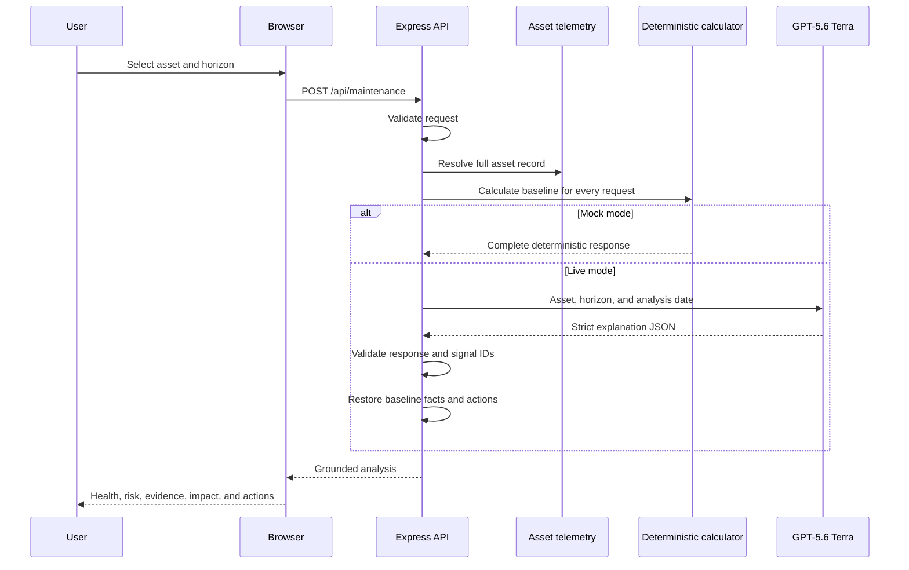

# Scenario 7: Predictive Maintenance and Energy

## Purpose

This scenario evaluates fictional condition-monitoring signals, calculates deterministic risk and energy impact, and uses GPT-5.6 Terra to explain the evidence. The language model does not measure equipment or replace the server's calculated readings.

## Components

| Layer | Implementation |
| --- | --- |
| Asset selector and condition report | `public/app.js` |
| API route | `POST /api/maintenance` in `server.js` |
| Contracts | `maintenanceRequestSchema`, `maintenanceOutputSchema`, and `maintenanceJsonSchema` in `src/schemas.js` |
| Asset telemetry | `maintenanceAssets` in `src/operations-data.js` |
| Deterministic calculation | `analyseMaintenance()` in `src/mock-services.js` |
| Live explanation and grounding | `analyseMaintenance()` and `groundMaintenanceAnalysis()` in `src/providers/gpt.js` |

## End-to-end flow



The baseline calculation runs in both modes. Live mode uses Terra for narrative interpretation but then restores authoritative calculated fields.

## HTTP request

```http
POST /api/maintenance
Content-Type: application/json
```

```json
{
  "mode": "live",
  "assetId": "asset-meridian-chiller-02",
  "horizon": 30
}
```

### Request schema

```ts
type MaintenanceRequest = {
  mode?: "mock" | "live";
  assetId: string;
  horizon: 7 | 30 | 90; // numeric strings are coerced before enum-like validation
};
```

Unknown assets return HTTP 404. Other horizon values return HTTP 400.

## Asset source-data schema

```ts
type MaintenanceAsset = {
  id: string;
  buildingId: string;
  buildingName: string;
  name: string;
  system: string;
  location: string;
  criticality: string;
  commissioned: string;
  lastService: string;
  operatingHours: number;
  dataCompleteness: number;
  diagnosis: string;
  riskOnsetDays: number;
  forecastWindow: string;
  energyImpact: {
    excessKwhPerDay: number;
    costPerMonth: number;
    annualEmissionsTonnes: number;
  };
  trend: number[];
  trendUnit: string;
  signals: Array<{
    id: string;
    label: string;
    current: number;
    unit: string;
    baseline: number;
    warning: number;
    critical: number;
    direction: "high" | "low";
  }>;
  recommendedActions: Array<{
    priority: "Now" | "7 days" | "30 days";
    action: string;
    owner: string;
    timing: string;
  }>;
};
```

The four fictional assets are a chiller, an air handler, a dock leveller, and a passenger lift.

## Deterministic baseline calculation

For each signal, `signalSeverity()` calculates movement from baseline toward the critical threshold:

```text
range =
  baseline - critical, for a low-direction signal
  critical - baseline, for a high-direction signal

deviation =
  baseline - current, for a low-direction signal
  current - baseline, for a high-direction signal

ratio = max(0, deviation / range)
```

Severity is assigned as:

1. `Critical` when the reading crosses the critical threshold.
2. `Elevated` when it crosses the warning threshold.
3. `Watch` when the normalized ratio is at least 0.35.
4. `Normal` otherwise.

Overall risk uses:

```text
averageRisk = average(min(signal ratio, 1.2))
peakRisk = maximum(signal ratio)
riskIndex = min(1.2, averageRisk * 0.55 + peakRisk * 0.45)
healthScore = clamp(round(99 - riskIndex * 64), 12, 99)
```

When at least one signal is critical and average risk is at least 0.65, health is capped at 30 and condition risk becomes `Critical`. Otherwise:

| Health score | Condition risk |
| ---: | --- |
| 73-99 | Low |
| 51-72 | Moderate |
| 31-50 | High |
| Critical pattern | Critical |

If the selected horizon is shorter than `riskOnsetDays`, displayed failure risk is reduced by one level. High or Critical condition risk creates a fictional draft work order.

## Live model input

```ts
type MaintenanceModelInput = {
  asset: MaintenanceAsset;
  horizonDays: 7 | 30 | 90;
  analysisDate: "16 July 2026";
};
```

Terra receives the full fictional asset record, including telemetry, thresholds, trend, pre-authored diagnosis, energy impact, and recommended actions. It is told to distinguish observed signals from predicted risk, explain uncertainty, require technician verification, and use only supplied signal IDs and values.

The separately calculated baseline is not sent in the model input, but is retained server-side for grounding.

## Response schema

```ts
type MaintenanceResponse = {
  mode: "mock" | "live";
  assetId: string;
  healthScore: number; // integer, 0-100
  failureRisk: "Low" | "Moderate" | "High" | "Critical";
  confidence: number;  // integer, 0-100
  predictedIssue: string; // 10-300
  forecastWindow: string; // 5-180
  summary: string;        // 20-1,000
  evidence: Array<{
    signalId: string;
    label: string;
    reading: string;
    severity: "Normal" | "Watch" | "Elevated" | "Critical";
    interpretation: string; // 10-500
  }>;                      // 2-5
  actions: Array<{
    priority: "Now" | "7 days" | "30 days";
    action: string;        // 10-500
    owner: string;         // 2-120
    timing: string;        // 2-160
  }>;                      // 1-5
  energyImpact: {
    excessKwhPerDay: number;
    costPerMonth: number;
    annualEmissionsTonnes: number;
    narrative: string;     // 10-400
  };
  workOrder: {
    created: boolean;
    reference: string;
    title: string;
    status: string;
  };
  assumptions: string[];   // 1-5
};
```

## Grounding controls

For a Live result, `groundMaintenanceAnalysis()`:

1. requires exactly one evidence item for every asset signal;
2. rejects unknown, duplicate, or missing signal IDs;
3. restores health score, risk, confidence, diagnosis, and forecast from the baseline;
4. restores each signal label, displayed reading, and severity;
5. restores numeric energy impact, actions, and work-order state;
6. retains Terra's summary, signal interpretations, energy narrative, and assumptions.

This separation allows model-generated explanation without allowing the model to change telemetry or calculated operational decisions.

## Data and operational boundaries

- Every signal, cost, emissions figure, diagnosis, and action is fictional.
- There is no BMS, IoT, CMMS, historian, weather, or occupancy integration.
- Trend arrays are repository fixtures, not live sensor streams.
- A created work order is response JSON only and is not persisted.
- A technician must verify readings and diagnosis before isolation or repair.
