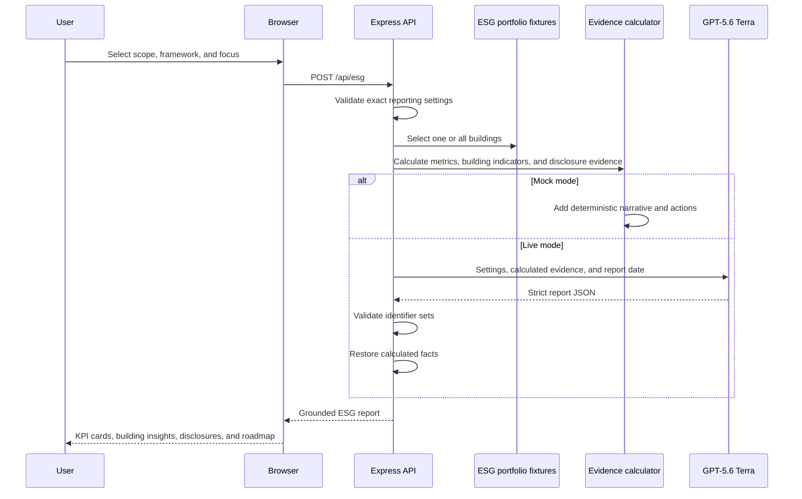

# Scenario 8: ESG and Sustainability Copilot

## Purpose

This scenario calculates portfolio sustainability indicators from fictional building records and uses GPT-5.6 Terra to draft management commentary, disclosure summaries, and actions. Numeric evidence remains server-calculated and source-grounded.

## Components

| Layer | Implementation |
| --- | --- |
| Scope form and report | `public/app.js` |
| API route | `POST /api/esg` in `server.js` |
| Contracts | `esgRequestSchema`, `esgOutputSchema`, and `esgJsonSchema` in `src/schemas.js` |
| Portfolio records | `esgPortfolio` in `src/operations-data.js` |
| Evidence calculations | `buildEsgEvidence()` in `src/mock-services.js` |
| Mock narrative | `createEsgReport()` in `src/mock-services.js` |
| Live narrative and grounding | `draftEsgReport()` and `groundEsgReport()` in `src/providers/gpt.js` |

## End-to-end flow



## HTTP request

```http
POST /api/esg
Content-Type: application/json
```

```json
{
  "mode": "live",
  "settings": {
    "scope": "portfolio",
    "reportingPeriod": "FY2026 · 1 July 2025–30 June 2026",
    "framework": "GRESB review draft",
    "focus": "Balanced portfolio"
  }
}
```

### Request schema

```ts
type EsgRequest = {
  mode?: "mock" | "live";
  settings: {
    scope: string; // "portfolio" or a known building ID; 1-80 characters
    reportingPeriod: "FY2026 · 1 July 2025–30 June 2026";
    framework:
      | "GRESB review draft"
      | "NABERS evidence pack"
      | "Internal net-zero review";
    focus:
      | "Balanced portfolio"
      | "Carbon & energy"
      | "Resource efficiency";
  };
};
```

`reportingPeriod`, `framework`, and `focus` are closed values. A scope that does not match `portfolio` or a building ID is rejected when evidence is built.

## Portfolio source-data schema

```ts
type EsgPortfolio = {
  period: string;
  methodology: string;
  disclosures: Array<{
    topic: string;
    status: "Ready" | "Partial" | "Gap";
    evidence: string;
    gap: string;
  }>;
  buildings: Array<{
    buildingId: string;
    name: string;
    type: string;
    floorAreaSqm: number;
    electricityMwh: number;
    previousElectricityMwh: number;
    gasGj: number;
    renewablePercent: number;
    previousRenewablePercent: number;
    waterKl: number;
    previousWaterKl: number;
    wasteTonnes: number;
    recycledTonnes: number;
    previousWasteTonnes: number;
    previousRecycledTonnes: number;
    scope1Tonnes: number;
    scope2Tonnes: number;
    previousEnergyMwh: number;
    previousEmissionsTonnes: number;
    targetEnergyIntensity: number;
    occupancyPercent: number;
    dataCompleteness: number;
    previousDataCompleteness: number;
  }>;
};
```

The three fictional records represent Meridian House, The Arcade, and Southbank Exchange.

## Server-side evidence calculations

The selected scope is converted into six metrics:

| Metric | Calculation |
| --- | --- |
| Energy intensity | `(electricity MWh + gas GJ / 3.6) * 1,000 / floor area m²` |
| Scope 1 + 2 emissions | Sum of Scope 1 and Scope 2 tonnes |
| Renewable electricity | Electricity-weighted average renewable percentage |
| Water intensity | Total water kL / floor area m² |
| Waste diversion | Recycled tonnes / total waste tonnes * 100 |
| Data completeness | Floor-area-weighted completeness percentage |

Year-on-year change is:

```text
(current - previous) / previous * 100
```

Each building receives:

```ts
type CalculatedBuildingEvidence = {
  buildingId: string;
  name: string;
  energyIntensity: number;
  carbonIntensity: number;
  waterIntensity: number;
  dataCompleteness: number;
  status: "On track" | "Watch" | "Off track";
};
```

For lower-is-better targets:

- at or below target: `On track`;
- up to 110% of target: `Watch`;
- above that: `Off track`.

For higher-is-better targets:

- at or above target: `On track`;
- at least 80% of target: `Watch`;
- below that: `Off track`.

Disclosure evidence is adjusted for a single-building scope, such as changing portfolio-wide wording to the selected building and marking water evidence ready where the industrial submeter gap does not apply.

## Calculated evidence schema

```ts
type EsgEvidence = {
  scope: string;
  reportingPeriod: string;
  framework: string;
  metrics: Array<{
    key:
      | "energy-intensity"
      | "operational-emissions"
      | "renewable-electricity"
      | "water-intensity"
      | "waste-diversion"
      | "data-completeness";
    label: string;
    value: number;
    unit: string;
    changePercent: number;
    target: string;
    status: "On track" | "Watch" | "Off track";
  }>;
  buildings: CalculatedBuildingEvidence[];
  disclosures: Array<{
    topic: string;
    status: "Ready" | "Partial" | "Gap";
    evidence: string;
    gap: string;
  }>;
  methodology: string;
};
```

## Live model input

```ts
type EsgModelInput = {
  settings: EsgRequest["settings"];
  evidence: EsgEvidence;
  reportDate: "16 July 2026";
};
```

Terra receives calculated evidence rather than raw monthly utility records. It is asked to preserve all metric keys, building IDs, and disclosure topics exactly once, flag partial evidence, avoid claims of compliance or assurance, and produce practical actions.

## Response schema

```ts
type EsgResponse = {
  mode: "mock" | "live";
  scope: string;
  reportingPeriod: string;
  framework: string;
  assuranceStatus: "Draft" | "Review ready" | "Data gaps";
  executiveSummary: string; // 30-1,400
  metrics: Array<{
    key: string;
    label: string;
    value: number;
    unit: string;
    changePercent: number;
    target: string;
    status: "On track" | "Watch" | "Off track";
    commentary: string;     // 10-400
  }>;                       // 4-8
  buildings: Array<{
    buildingId: string;
    name: string;
    energyIntensity: number;
    carbonIntensity: number;
    waterIntensity: number;
    dataCompleteness: number;
    status: "On track" | "Watch" | "Off track";
    insight: string;        // 10-400
  }>;                       // 1-3
  disclosures: Array<{
    topic: string;
    status: "Ready" | "Partial" | "Gap";
    summary: string;        // 10-500
    evidence: string;       // 2-300
    gap: string;            // up to 300
  }>;                       // 3-6
  actions: Array<{
    priority: "High" | "Medium" | "Low";
    action: string;         // 10-500
    owner: string;          // 2-120
    dueDate: string;        // 2-100
    impact: string;         // 5-300
  }>;                       // 2-6
  methodology: string;      // 10-600
  caveats: string[];        // 2-6
};
```

## Grounding controls

For a Live report, `groundEsgReport()` requires exact, duplicate-free sets for:

- all calculated metric keys;
- all selected building IDs;
- all disclosure topics.

It then restores:

- scope, reporting period, and framework;
- assurance status derived from evidence gaps;
- every metric's label, value, unit, change, target, and status;
- every building's name and numeric indicators;
- every disclosure's source status, evidence, and gap;
- the repository-defined methodology.

Terra retains authorship of executive narrative, metric commentary, building insight, disclosure summary, actions, and caveats.

## Mock behavior

Mock mode uses the same calculated evidence. It adds deterministic commentary and chooses three actions based on `focus`:

- carbon and energy prioritizes plant optimization and renewable procurement;
- resource efficiency prioritizes water, waste, and evidence quality;
- balanced scope combines evidence closure, facilities optimization, and procurement.

## Data and assurance boundaries

- All records, targets, factors, and disclosure evidence are fictional.
- No utility platform, meter, waste contractor, GRESB, NABERS, accounting system, or assurance provider is connected.
- Source records and report outputs are not persisted.
- Live mode sends settings and calculated fictional evidence to the Azure model endpoint.
- The report is explicitly unaudited and must not be used as certification, regulatory compliance evidence, or external assurance.
